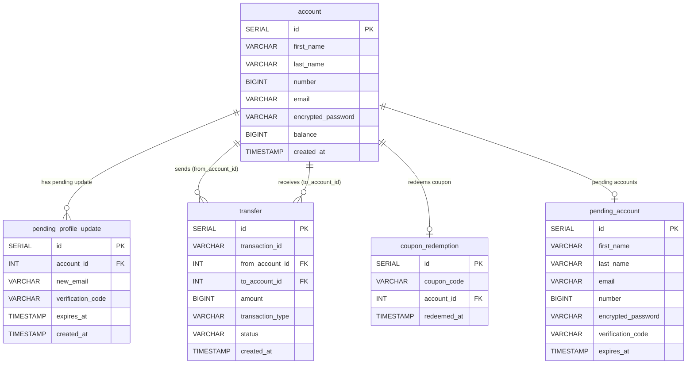

# Online Banking System

This is a full-stack online banking application featuring a Go backend and a Next.js frontend.

---

## Table of Contents

- [Overview](#overview)
- [Tech Stack](#tech-stack)
  - [Backend](#backend)
  - [Frontend](#frontend)
- [Project Structure](#project-structure)
- [Getting Started](#getting-started)
  - [Prerequisites](#prerequisites)
  - [Backend Setup](#backend-setup)
  - [Frontend Setup](#frontend-setup)
- [Database Schema](#database-schema)
- [API Endpoints](#api-endpoints)
- [Authentication](#authentication)
- [Configuration](#configuration)

---

## Overview

This project is a modern online banking system. It consists of two main parts:

*   **Backend**: A RESTful API built with Go that handles all the business logic, including account management, authentication, transfers, and more.
*   **Frontend**: A responsive web application built with Next.js that provides a user-friendly interface for interacting with the banking system.

---

## Tech Stack

### Backend

| Category | Technology |
|---|---|
| Language | Go |
| HTTP Router | [Gorilla Mux](https://github.com/gorilla/mux) v1.8.1 |
| Database | PostgreSQL (`lib/pq` driver) |
| Authentication | JWT ([golang-jwt/jwt](https://github.com/golang-jwt/jwt) v5), WebAuthn ([go-webauthn/webauthn](https://github.com/go-webauthn/webauthn)) |
| Password Hashing | bcrypt (`golang.org/x/crypto`) |
| Email | Gmail SMTP (`net/smtp`) |
| Environment | [godotenv](https://github.com/joho/godotenv) |
| Testing | [Testify](https://github.com/stretchr/testify) |
| Build Tool | Make |

### Frontend

| Category | Technology |
|---|---|
| Framework | Next.js 16.2.9 |
| Language | TypeScript |
| UI Library | React 19.2.4 |
| Styling | Tailwind CSS 4 |
| Linting | ESLint |

---

## Project Structure

```
online-banking-system-ds/
├── backend/           # Go backend application
│   ├── main.go        # Entry point, server setup
│   ├── api.go         # API handlers and routing
│   ├── storage.go     # Database logic
│   ├── webauthn.go    # WebAuthn implementation
│   ├── go.mod         # Backend dependencies
│   ├── makefile       # Build and run scripts
│   └── ...
├── frontend/          # Next.js frontend application
│   ├── app/           # App router, pages and layouts
│   ├── components/    # React components
│   ├── lib/           # Helper functions and utilities
│   ├── package.json   # Frontend dependencies and scripts
│   └── ...
└── README.md          # This file
```

---

## Getting Started

### Prerequisites

*   **Go**: 1.21 or later
*   **Node.js**: 20 or later
*   **pnpm**: (or npm/yarn)
*   **PostgreSQL**: A running instance

### Backend Setup

1.  **Navigate to the backend directory:**
    ```bash
    cd backend
    ```

2.  **Install dependencies:**
    ```bash
    go mod download
    ```

3.  **Set up environment variables:**
    Create a `.env` file in the `backend` directory. See the [Configuration](#configuration) section for more details on the available variables.
    ```env
    JWT_SECRET=your-secret-key
    DB_HOST=localhost
    DB_PORT=5432
    DB_USER=postgres
    DB_PASSWORD=gobank
    DB_NAME=postgres
    ```

4.  **Run the backend server:**
    ```bash
    make run
    ```
    The backend server will start on `http://localhost:3000`.

### Frontend Setup

1.  **Navigate to the frontend directory:**
    ```bash
    cd frontend
    ```

2.  **Install dependencies:**
    ```bash
    pnpm install
    ```

3.  **Run the frontend development server:**
    ```bash
    pnpm dev
    ```
    The frontend application will be available at `http://localhost:8080`.

---

## Database Schema

The application uses five tables, all created automatically on startup.

### Entity Relationship Diagram



---

## API Endpoints

| Method | Path | Auth Required | Description |
|---|---|---|---|
| `POST` | `/login` | No | Authenticate with account number + password; returns a JWT token |
| `GET` | `/account` | No | List all accounts |
| `POST` | `/account` | No | Start account registration — validates input and sends a 6-digit verification code to the provided email |
| `POST` | `/account/verification` | No | Verify the 6-digit code; creates and returns the fully activated account |
| `POST` | `/account/update` | **JWT** | Update profile name, email (two-step OTP), or password — see action-based request shapes below |
| `GET` | `/account/{id}` | **JWT** | Get a specific account by ID |
| `DELETE` | `/account/{id}` | **JWT** | Delete an account by ID |
| `POST` | `/account/{id}/offer` | **JWT** | Redeem the `OFFER1000` coupon to add 1,000 to balance (one-time per account) |
| `GET` | `/account/transactions` | **JWT** | Get paginated transaction history for the authenticated user |
| `POST` | `/transfer` | **JWT** | Transfer funds between accounts; sends email receipts to both parties |

---

## Authentication

Authentication is handled via JWTs and WebAuthn. Most write operations and all per-account reads require a valid JWT token in the `Authorization` HTTP header:

```
Authorization: <token>
```

Tokens are obtained from the `POST /login` endpoint and are valid for **24 hours**.

---

## Configuration

The backend can be configured via environment variables or a `.env` file in the `backend` directory.

| Setting | Environment Variable | Default / Notes |
|---|---|---|
| Server port | *(hardcoded)* | `:3000` |
| Full DB connection string | `DATABASE_URL` | Overrides individual `DB_*` variables when set |
| Database host | `DB_HOST` | `localhost` |
| Database port | `DB_PORT` | `5432` |
| Database user | `DB_USER` | `postgres` |
| Database password | `DB_PASSWORD` | `gobank` |
| Database name | `DB_NAME` | `postgres` |
| JWT signing secret | `JWT_SECRET` | Required |
| SMTP sender email | `SMTP_EMAIL` | Optional; if absent, emails are only logged to stdout |
| SMTP sender password | `SMTP_PASSWORD` | Optional; if absent, emails are only logged to stdout |

